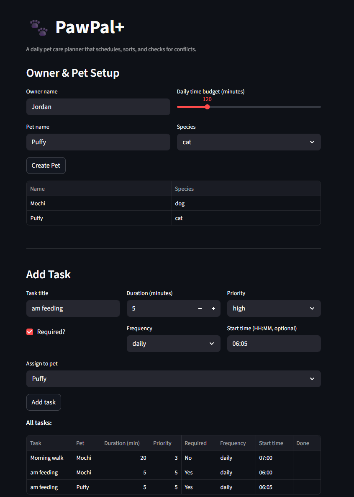

# PawPal+ (Module 2 Project)

You are building **PawPal+**, a Streamlit app that helps a pet owner plan care tasks for their pet.

## Scenario

A busy pet owner needs help staying consistent with pet care. They want an assistant that can:

- Track pet care tasks (walks, feeding, meds, enrichment, grooming, etc.)
- Consider constraints (time available, priority, owner preferences)
- Produce a daily plan and explain why it chose that plan

Your job is to design the system first (UML), then implement the logic in Python, then connect it to the Streamlit UI.

## What you will build

Your final app should:

- Let a user enter basic owner + pet info
- Let a user add/edit tasks (duration + priority at minimum)
- Generate a daily schedule/plan based on constraints and priorities
- Display the plan clearly (and ideally explain the reasoning)
- Include tests for the most important scheduling behaviors

## Features

- **Priority-based scheduling** — Tasks are ranked by `required` status first, then by priority level (1–5). Required tasks always claim time slots before optional ones, regardless of priority score.
- **Bin-packing plan generation** — The scheduler never stops early when a task doesn't fit. It continues iterating so smaller lower-priority tasks can fill leftover minutes after a large task is skipped.
- **Chronological sorting** — `sort_by_time` converts `"HH:MM"` strings to total minutes before comparing, avoiding lexicographic pitfalls (e.g. `"9:00"` incorrectly sorting after `"13:30"`). Tasks with no start time are grouped at the end.
- **Task filtering** — `filter_tasks` accepts an optional pet name and/or completion status and combines them with AND logic, making it easy to show one pet's incomplete tasks or a full cross-pet to-do list.
- **Daily and weekly recurrence** — Marking a task complete automatically creates the next occurrence with a computed `due_date` (`timedelta(days=1)` or `timedelta(weeks=1)`). Python's `timedelta` handles month and year rollovers automatically.
- **Conflict detection** — Every pair of scheduled timed tasks is checked using the interval-overlap formula `A.start < B.end AND B.start < A.end`. Conflicts are reported with scope (`same pet` or `different pets`); tasks without a start time produce a warning instead of a false negative.
- **Task deduplication** — `get_all_tasks` tracks seen IDs across all pets so a task shared between pets is never double-scheduled.
- **Plan cache with dirty flag** — The generated plan is cached and only recomputed when tasks are added, removed, or marked complete. This avoids redundant sorting passes on every UI rerender.
- **Editable tasks** — Any task field (title, duration, priority, required, frequency, start time) can be updated in place through the UI. The cache is invalidated immediately so the next schedule generation reflects the change.
- **Conflict warnings in the UI** — Overlapping tasks surface as `st.warning` banners with task names, time windows, and a plain-language fix suggestion. Missing start times appear as `st.info` notices so the owner knows what still needs to be checked.

---

## Smarter Scheduling

The `Scheduler` class goes beyond a basic priority sort. Here is a summary of the features added incrementally:

### Task sorting
`sort_by_time(tasks)` orders any list of tasks by their `start_time` field (`"HH:MM"` format). Times are converted to total minutes since midnight before comparing, so `"9:00"` correctly sorts before `"13:30"`. Tasks with no `start_time` are placed at the end.

### Task filtering
`filter_tasks(pet_name, completed)` returns a subset of tasks across all pets. Both parameters are optional and combine with AND logic:
- `filter_tasks(completed=False)` — incomplete tasks only (today's to-do list)
- `filter_tasks(pet_name="Buddy")` — all tasks for one pet
- `filter_tasks(pet_name="Buddy", completed=True)` — Buddy's completed tasks only

### Recurring tasks
Tasks have a `frequency` field (`"daily"` or `"weekly"`). Calling `mark_task_complete(task_id)` marks the task done and automatically creates the next occurrence with a new `due_date` computed using Python's `timedelta`:
- Daily tasks: `due_date = today + timedelta(days=1)`
- Weekly tasks: `due_date = today + timedelta(weeks=1)`

The new task is added to the same pet's list and carries over all original fields (priority, duration, start time).

### Conflict detection
`detect_conflicts()` checks every pair of scheduled timed tasks for overlapping time windows using the interval-overlap formula `A.start < B.end AND B.start < A.end`. It returns a list of plain-text warning strings — never raises an exception — so the caller decides how to surface them. Each warning is prefixed:
- `CONFLICT (same pet)` — two of the same pet's tasks overlap
- `CONFLICT (different pets)` — tasks from different pets overlap
- `WARNING` — a task has no `start_time` and could not be checked

An empty list means the schedule is conflict-free.

### Plan generation
`generate_plan()` applies a multi-constraint scheduling strategy in one sorted pass:
1. Required tasks are guaranteed slots before optional ones
2. Incomplete tasks rank above already-completed ones (carrying forward unfinished work)
3. Within those groups, tasks are ordered by priority (1–5)
4. A bin-packing approach fills leftover minutes with smaller tasks rather than stopping at the first task that does not fit

Returns `(scheduled_tasks, skipped_tasks)` so both what fit and what did not can be shown to the owner.

---

## Testing PawPal+

### Running the tests

```bash
python -m pytest tests/test_pawpal.py -v
```

### What the tests cover

The suite contains 21 tests organized into five areas:

- **Happy paths** — all tasks fit within the budget, required tasks are scheduled before optional ones, and `explain_plan` lists both scheduled and skipped tasks.
- **Sorting correctness** — `sort_by_time` returns tasks in chronological order; tasks without a `start_time` are placed at the end.
- **Recurrence logic** — completing a daily task creates a new task due the next day; weekly tasks advance by 7 days; one-off tasks return `None`; unknown IDs raise `ValueError`.
- **Conflict detection** — overlapping tasks produce `CONFLICT` strings; adjacent (non-overlapping) tasks do not; tasks missing `start_time` produce `WARNING` strings; a clean schedule returns an empty list.
- **Edge cases** — pet with no tasks, zero-budget owner, task duration exactly equal to budget, duplicate task IDs across pets, and cache invalidation after mutations.

### Confidence Level

★★★★★ (5/5)

All 21 tests pass. Core scheduling, recurrence, sorting, and conflict detection are well covered.

### Demo




## Getting started

### Setup

```bash
python -m venv .venv
source .venv/bin/activate  # Windows: .venv\Scripts\activate
pip install -r requirements.txt
```

### Suggested workflow

1. Read the scenario carefully and identify requirements and edge cases.
2. Draft a UML diagram (classes, attributes, methods, relationships).
3. Convert UML into Python class stubs (no logic yet).
4. Implement scheduling logic in small increments.
5. Add tests to verify key behaviors.
6. Connect your logic to the Streamlit UI in `app.py`.
7. Refine UML so it matches what you actually built.
