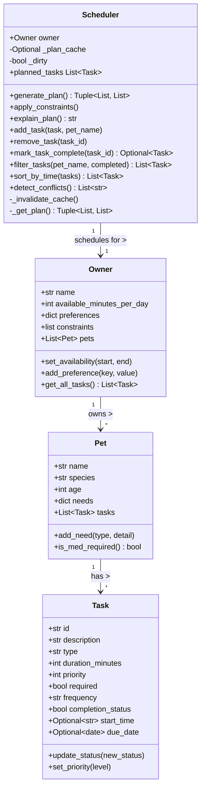

# PawPal+ UML Class Diagram

```mermaid
classDiagram
    class Owner {
      +str name
      +int available_minutes_per_day
      +dict preferences
      +list constraints
      +List~Pet~ pets
      +set_availability(start, end)
      +add_preference(key, value)
      +get_all_tasks() List~Task~
    }

    class Pet {
      +str name
      +str species
      +int age
      +dict needs
      +List~Task~ tasks
      +add_need(type, detail)
      +is_med_required() bool
    }

    class Task {
      +str id
      +str description
      +str type
      +int duration_minutes
      +int priority
      +bool required
      +str frequency
      +bool completion_status
      +Optional~str~ start_time
      +Optional~date~ due_date
      +update_status(new_status)
      +set_priority(level)
    }

    class Scheduler {
      +Owner owner
      -Optional _plan_cache
      -bool _dirty
      +planned_tasks List~Task~
      +generate_plan() Tuple~List, List~
      +apply_constraints()
      +explain_plan() str
      +add_task(task, pet_name)
      +remove_task(task_id)
      +mark_task_complete(task_id) Optional~Task~
      +filter_tasks(pet_name, completed) List~Task~
      +sort_by_time(tasks) List~Task~
      +detect_conflicts() List~str~
      -_invalidate_cache()
      -_get_plan() Tuple~List, List~
    }

    Owner "1" --> "*" Pet : owns >
    Pet "1" --> "*" Task : has >
    Scheduler "1" --> "1" Owner : schedules for >
```