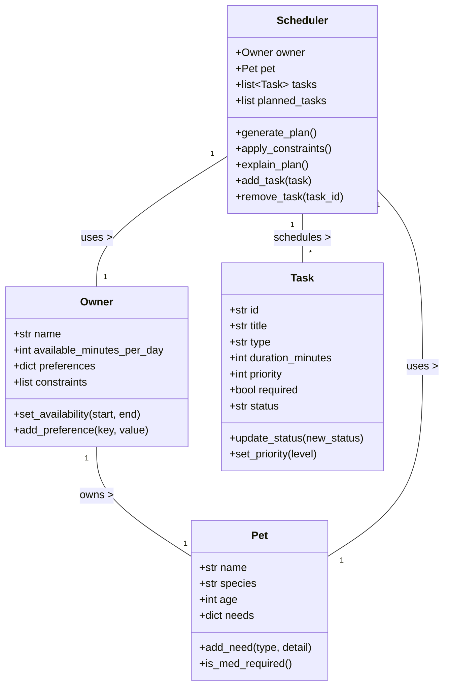

# PawPal+ UML Class Diagram

```mermaid
classDiagram
    class Owner {
      +str name
      +int available_minutes_per_day
      +dict preferences
      +list constraints
      +set_availability(start, end)
      +add_preference(key, value)
    }

    class Pet {
      +str name
      +str species
      +int age
      +dict needs
      +add_need(type, detail)
      +is_med_required()
    }

    class Task {
      +str id
      +str title
      +str type
      +int duration_minutes
      +int priority
      +bool required
      +str status
      +update_status(new_status)
      +set_priority(level)
    }

    class Scheduler {
      +Owner owner
      +Pet pet
      +list~Task~ tasks
      +list planned_tasks
      +generate_plan()
      +apply_constraints()
      +explain_plan()
      +add_task(task)
      +remove_task(task_id)
    }

    Owner "1" -- "1" Pet : owns >
    Scheduler "1" -- "1" Owner : uses >
    Scheduler "1" -- "1" Pet : uses >
    Scheduler "1" -- "*" Task : schedules >
```